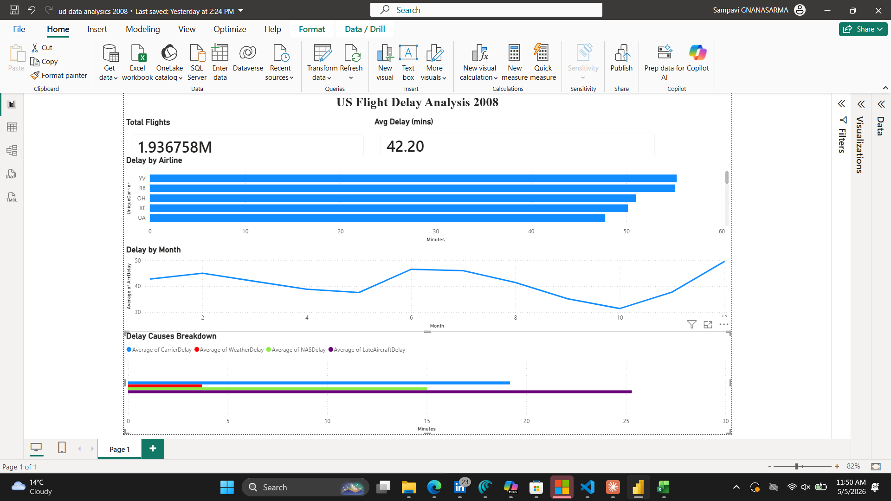

# aviation-delay-analysis

# ✈️ US Flight Delay Analysis 2008

## Project Overview
Analysis of 1.9 million US domestic flights 
to identify key delay patterns.

## Key Findings
- YV & B6 airlines delay the most (55 mins avg)
- December is the worst month for delays
- Late aircraft is the #1 cause of delays
- 1,936,758 total flights analysed

## Dashboard Preview

## Tools Used
- Power BI
- AI-assisted data analysis

## Dataset
Source: Kaggle — US Flight Delays 2008

## Note
The Power BI (.pbix) file is not uploaded 
due to file size. Dashboard screenshot 
is provided above.
